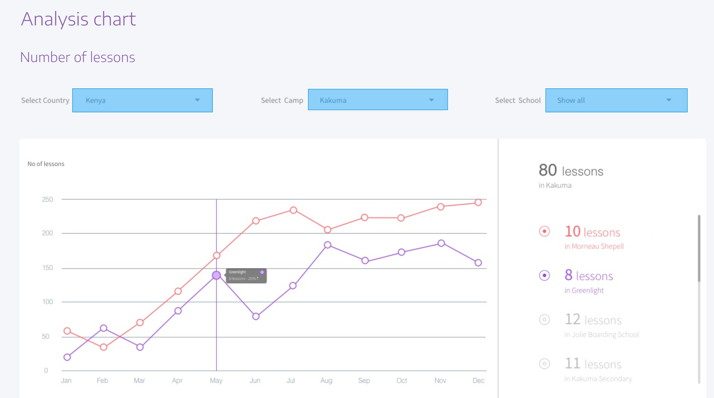

# AnalysisChallenge

This project was generated with [Angular CLI](https://github.com/angular/angular-cli) version 10.2.0.
The challenge is to implement an analytics dashboard like this one with the description below:

## Development server

Run `ng serve` for a dev server. Navigate to `http://localhost:4200/`. The app will automatically reload if you change any of the source files.

## Code scaffolding

Run `ng generate component component-name` to generate a new component. You can also use `ng generate directive|pipe|service|class|guard|interface|enum|module`.

## Build

Run `ng build` to build the project. The build artifacts will be stored in the `dist/` directory. Use the `--prod` flag for a production build.

## Running unit tests

Run `ng test` to execute the unit tests via [Karma](https://karma-runner.github.io).

## Running end-to-end tests

Run `ng e2e` to execute the end-to-end tests via [Protractor](http://www.protractortest.org/).

## Further help

To get more help on the Angular CLI use `ng help` or go check out the [Angular CLI Overview and Command Reference](https://angular.io/cli) page.

## Acceptance Criteria

1. A loading screen is expected while fetching the "data.json" from server. You can use the "raw" file directly from Github or serve it from a local server.
2. The 3 drop-down lists at the top should filter the data. "Select School" should have the option to "Show all".
3. A chart renders the data of the selected schools similarly to the image.
4. On the right of the screen, the total number of lessons is displayed for the selected Camp, School and Country, followed by a list of the schools with how many lessons each offers.
5. The schools list from point 4 should include toggles to show or hide the line chart of a certain school.
6. Upon clicking on a point in the chart from point 3, the app should navigate to another page where all the details of that item are shown. No UX is provided, but use a simple layout that shows: like country, camp, school, month and number of lessons.
7. After coming back from the details page implemented in point 6, the last filtering state should be preserved.

## Requirements

- Use (Angular 2+ Or ReactJS) and Chart.js(or any other free chart libraries).
- Good unit-test cases is required to secure the code. Bonus if E2E testing is implemented.
- The project should be performant and scalable. Try to follow best pratices in areas such as project structure, responsive web design, linting, documentation, components structure, layering, modularity.
- Bonus points:
  - Implement a toggle to switch on/off dark mode.
  - Multi-lingual support.
  - Store the data centrally by using any state-management library of your choice (EX: NgRx).

Note: The spec is vague on purpose. Please document in a separate markdown file any decisions you've made indicating your analysis and the justification for your choice. That documentation will be considered as part of the assessment.
